# DEPLOY-INFRA-AWS-FCJ-MISSION2

Tech Stack used in this project: Elastic Load Balancing, Amazon EC2, Auto Scaling Group, Amazon SNS, and Amazon Virtual Private Cloud

### Architecture

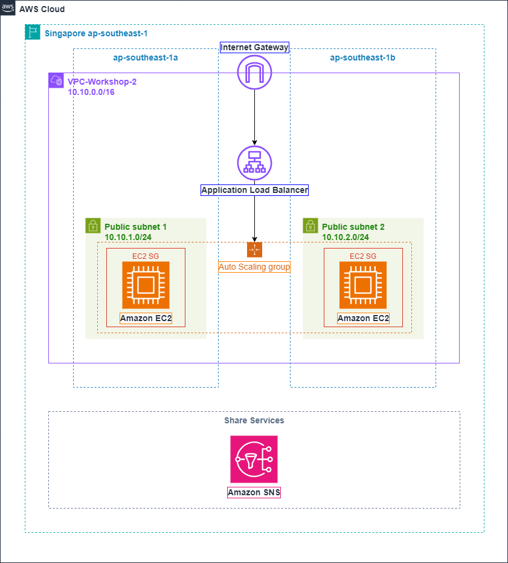

### Overview
In this lab, we will learn how to deploy a **highly available infrastructure** on AWS using **Terraform**, a popular infrastructure as code tool.

### Requirements

To do this lab, you will need to install [**Visual Studio Code**](https://code.visualstudio.com/), [**AWS CLI**](https://docs.aws.amazon.com/cli/latest/userguide/getting-started-install.html) and [**Terraform**](https://developer.hashicorp.com/terraform/install) on your local machine.

#### AWS Account

You should have an AWS account, which has an **IAM user** with **Administrative** permission.

#### Set up Visual Studio Code
After installing **Visual Studio Code** successfully, you can download an extension for Terraform called **HashiCorp Terraform**.


#### Set up Terraform
You can check if the **Terraform** is installed on your local machine by opening terminal and typing `terraform version`


#### Set up AWS CLI version 2
You can check if the **AWS CLI** is installed on your local machine by opening terminal and typing `aws --version`.


#### Access keys
Next, You will need to create an **Access keys**. Following these step below to create an **Access keys**.

1. Click on your AWS account and it will appears a tab. Choose **Security credentials**.

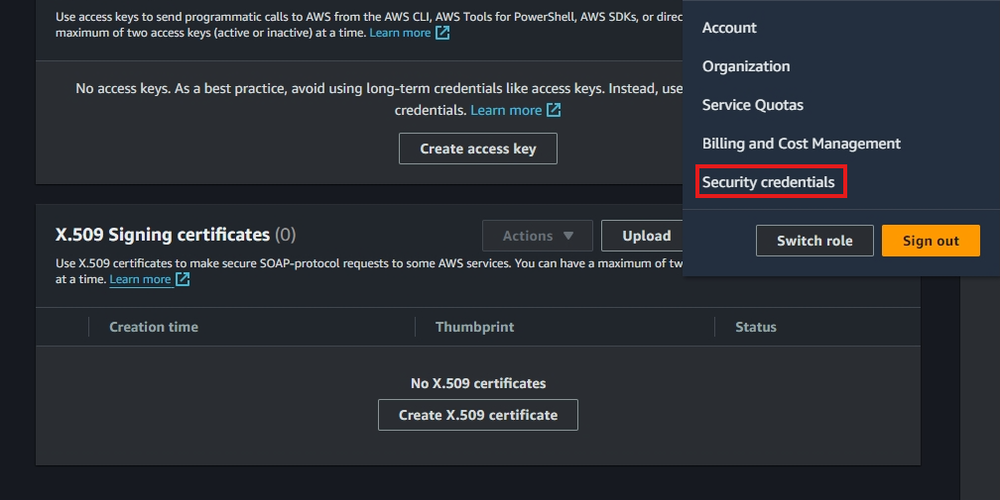

2. Scroll down, you will see an **Access keys** interface. Click on **Create access key**.

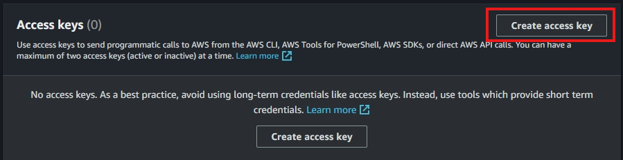

3. In the **Create access key** interface, choose **Third party service**.

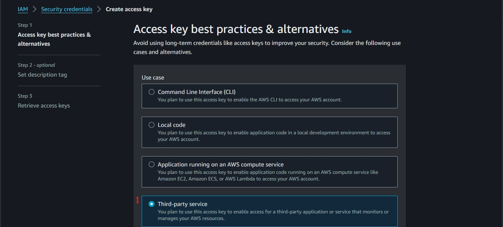

4. Then, check the square box. Choose **Next**.

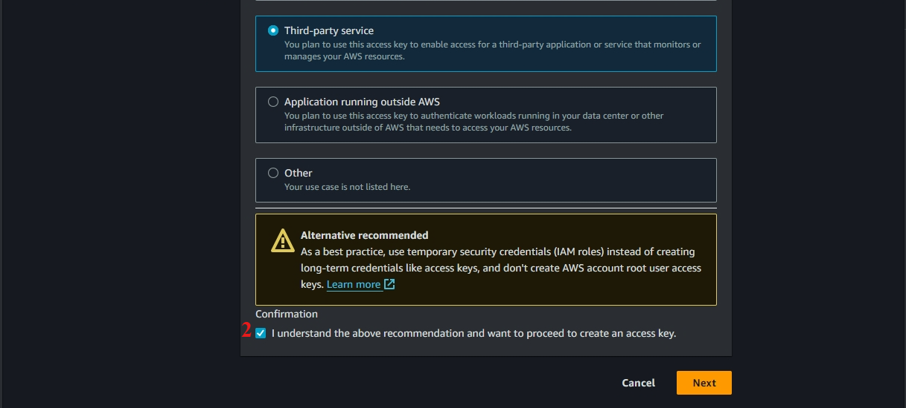

5. Click on **Create access key** 

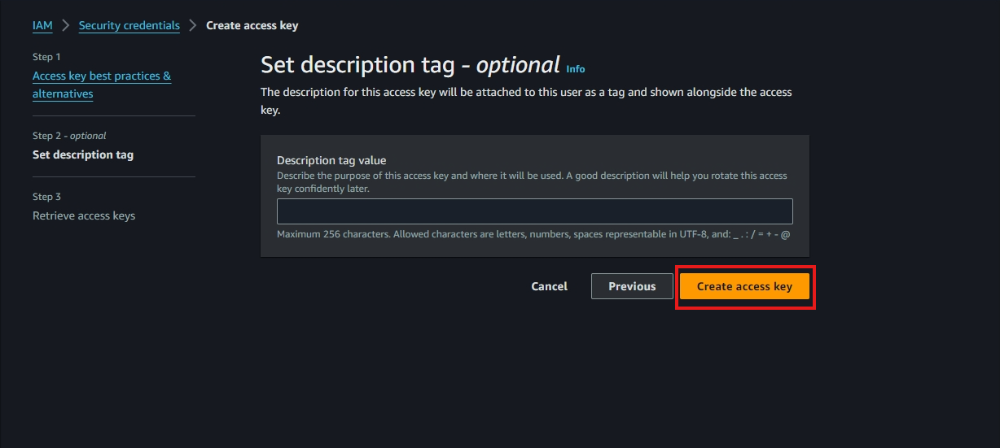

6. Click on **Download .csv file** and **Done**.

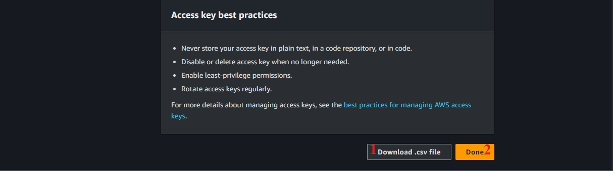

7. Open the .csv file. You will see it has an **access key** and a **secret key**.

8. Open the terminal and type `aws configure`. You will see some things appear in the terminal.

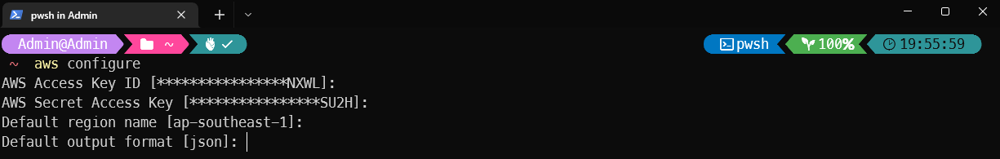

9. Configure like below:
- AWS Access Key ID: Assign **your access key**
- AWS Secret Access Key : Assign **your secret access key**
- Default region name: Enter `ap-southeast-1`
- Default output format: Enter `json`

#### Key pair

Here, we need to create a key pair. We can then use this key pair to SSH into our EC2 instances.

About keypair_name, access **AWS Management Console** and search for **EC2** (Remember change your region to **Singapore**) then click on **Key Pairs**.

- Click on **Create key pair**

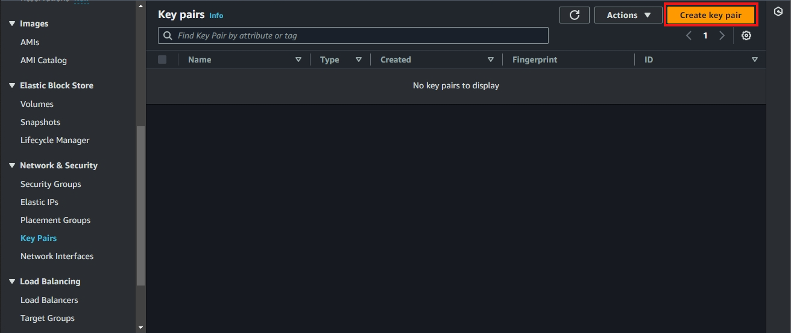

Configure like below.

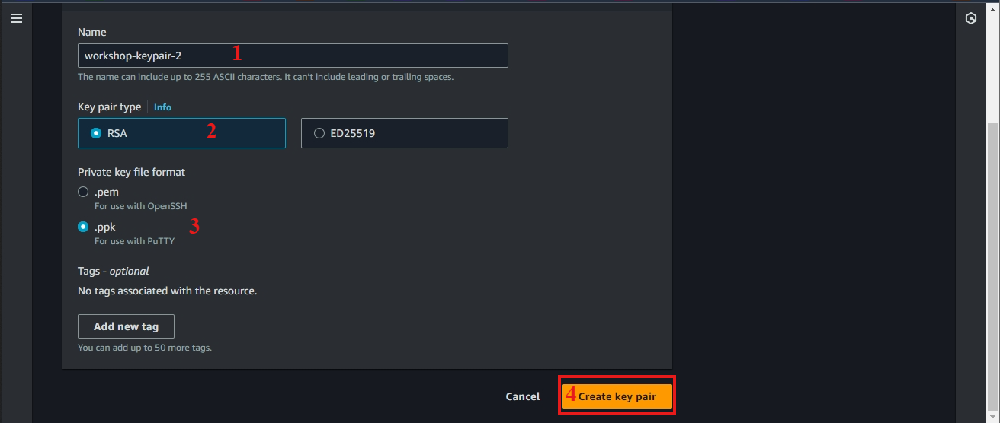

After creating key pair successfully, you will see a notification.


# Demo

1. First, clone this repository.

- HTTPS

```
git clone https://github.com/thnbao22/Demo-WorkshopAWS-Using-Terraform.git
```

- SSH

```
git clone git@github.com:thnbao22/Demo-WorkshopAWS-Using-Terraform.git
```

2. After cloning this repository, please open the project in Visual Studio Code and navigate to the **terraform** folder using the `cd` command on the terminal of Visual Studio Code

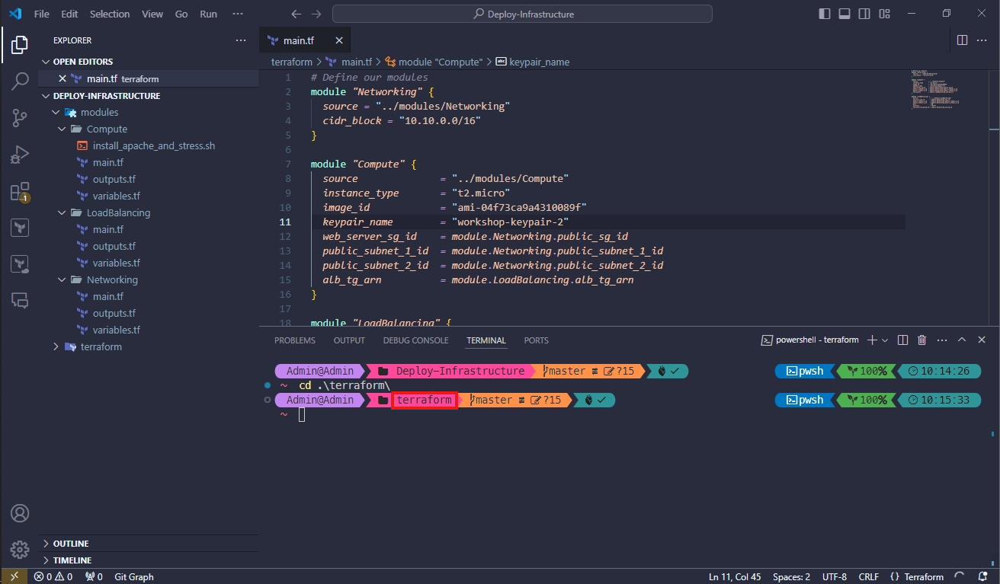